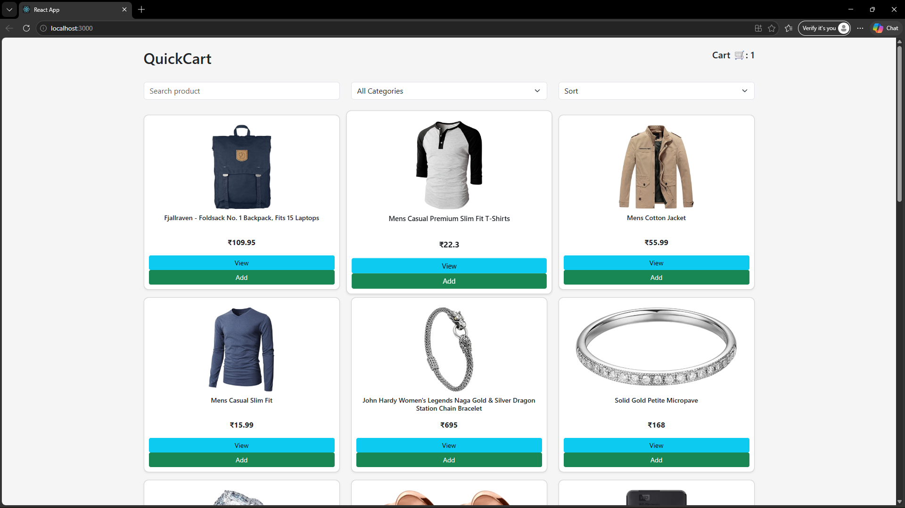

## Quick Cart App

A simple and responsive Shopping Cart Application built using React.
This project allows users to add items to the cart, view selected products, and manage quantities dynamically.

## Live Demo
https://quick-cart-frontend-three.vercel.app/

## Features

- Add items to cart
- Remove items from cart
- Update item quantity
- View total price
- Dynamic UI updates
- Responsive design
- Component-based structure

## Tech Stack

- React JS
- JavaScript
- HTML
- CSS

## Project Structure

src/
├── components/
│    ├── ProductList.js
│    ├── Cart.js
├── App.js
├── index.js
├── App.css

## Screenshots

## How to Run

cd quick-cart-app

npm install

npm start

## Future Improvements

- Add product images
- Add checkout page
- Add payment integration
- Store cart data in database

## Author

Naina
